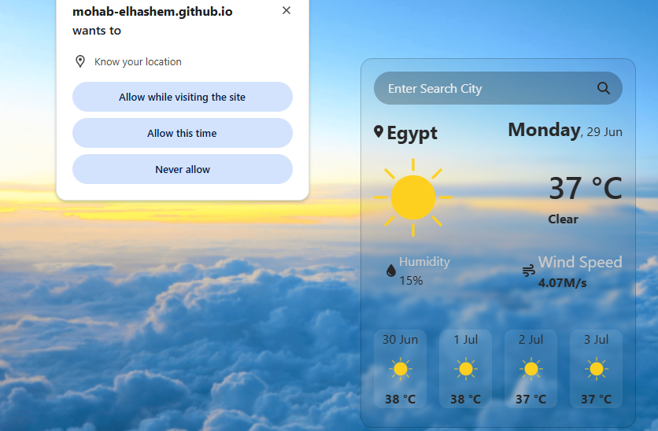

# Weather App

A modern, sleek, and highly responsive weather application built with Vanilla JavaScript and Bootstrap. The application fetches and displays real-time weather data and multi-day forecasts based on user locations or search queries.

---

## 🔗 Live Demo

Experience the application live in your browser:
🚀 **[View Live Demo](https://mohab-elhashem.github.io/OpenWeather-API/)**

---

## 📸 Preview

---

## 🚀 Features

* **Global Search:** Find current weather conditions for any city worldwide.
* **Real-Time Data:** Displays temperature, humidity, wind speed, and weather conditions instantly.
* **5-Day Forecast:** Provides an extended weather outlook to help users plan ahead.
* **Geolocation Support:** Automatically detects the user's current location to serve local weather updates immediately upon loading.
* **Dark Mode Toggle:** Smooth shifting between light and dark themes for a comfortable viewing experience at night.
* **Data Persistence:** Utilizes `LocalStorage` to remember user preferences (such as Dark Mode state or the last searched city).

---

## 🛠️ Tech Stack & Concepts Used

### 🎨 Front-End Styling & Layout
* **HTML5:** Semantic markup structure for accessibility and SEO-friendly layout.
* **CSS3:** Custom styling, smooth layout transitions, and variables to power the dynamic theme switching.
* **Bootstrap:** Leveraged grid systems, responsive utilities, and pre-built components (like cards and badges) to guarantee pixel-perfect responsiveness across mobile, tablet, and desktop viewports.

### ⚙️ JavaScript (ES6+) Logic
* **Asynchronous Programming:** Handled real-time data streaming from the **OpenWeather API** using `fetch`, `async/await`, and modern error handling.
* **DOM Manipulation:** Dynamically rendered weather metrics, icons, and forecast cards into the HTML document structure based on API responses.
* **Browser APIs:** Integrated the native HTML5 **Geolocation API** to securely access coordinate data and **Web Storage API (`localStorage`)** to cache layout settings.
* **Event Handling:** Bound interactive event listeners to process input searches, form submissions, and click toggles smoothly.
